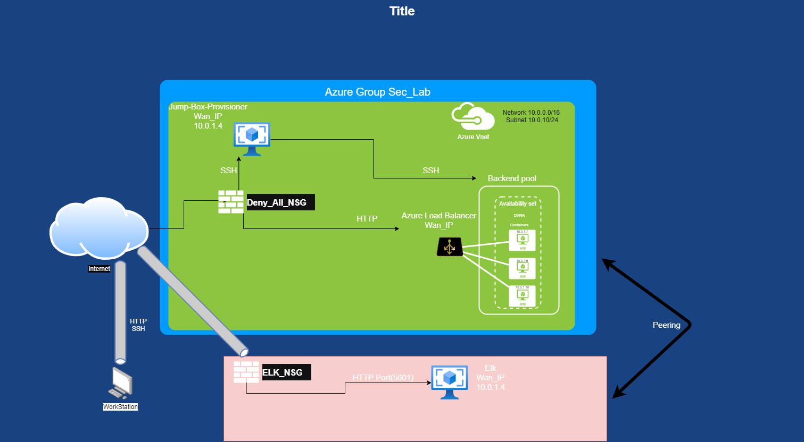
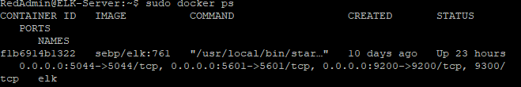

## Automated ELK Stack Deployment

The files in this repository were used to configure the network depicted below.

These files have been tested and used to generate a live ELK deployment on Azure. They can be used to either recreate the entire deployment pictured above. Alternatively, select portions of the file may be used to install only certain pieces of it, such as Filebeat.

- _[Elk Install](Ansible/install-elk.yml)_
- _[DVWA](Ansible/ansible_config.yml)_
- _[FileBeat](Ansible/filebeat-playbook.yml)_
- _[MetricBeat](Ansible/metricbeat-playbook.yml)_

This document contains the following details:

- Description of the Topology
- Access Policies
- ELK Configuration
  - Beats in Use
  - Machines Being Monitored
- How to Use the Ansible Build

### Description of the Topology

The main purpose of this network is to expose a load-balanced and monitored instance of DVWA, the D\*mn Vulnerable Web Application.

Load balancing ensures that the application will be highly highly available, in addition to restricting access to the network.

Integrating an ELK server allows users to easily monitor the vulnerable VMs for changes to the log files and system resources.

The configuration details of each machine may be found below.

| Name       | Function | IP Address | Operating System |
| ---------- | -------- | ---------- | ---------------- |
| Jump Box   | Gateway  | 10.0.1.4   | Linux            |
| VM         | Web Ser  | 10.0.1.7   | Linux            |
| VM2        | Web Ser  | 10.0.1.6   | Linux            |
| VM3        | Web Ser  | 10.0.1.10  | Linux            |
| ELK-Server | Web Ser  | 10.1.0.4   | Linux            |

### Access Policies

The machines on the internal network are not exposed to the public Internet.

Only the $MYIP machine can accept connections from the Internet. Access to this machine is only allowed from the following IP addresses:

- $MYIP

Machines within the network can only be accessed by the Jump box.

- _Jumpbox_
  - _PrivateIP: 10.0.1.4_

A summary of the access policies in place can be found in the table below.

| Name     | Publicly Accessible | Allowed IP Addresses |
| -------- | ------------------- | -------------------- |
| Jump Box | Yes                 | $MYIP                |
| Web1,2,3 | No                  | Web_LB - $lb_IP      |
| Web_LB   | Yes                 | \*                   |
| ELK      | Yes                 | 10.0.0.0/16 & $MYIP  |

### Elk Configuration

Ansible was used to automate configuration of the ELK machine. No configuration was performed manually, which is advantageous because...

- _The main advantage of automating configuration with Ansible is that you are simplifying information and reducue errors _

The playbook implements the following tasks:

- _Install Docker.io_
- _Install pip3_
- _Install Docker python module_
- _Use more memory_
- _Download and launch a docker elk container_
- _Enable service docker on boot_

The following screenshot displays the result of running `docker ps` after successfully configuring the ELK instance.

### Target Machines & Beats

This ELK server is configured to monitor the following machines:

- 10.0.1.7
- 10.0.1.6
- 10.0.1.10

We have installed the following Beats on these machines:

- 10.0.1.7
- 10.0.1.6
- 10.0.1.10

These Beats allow us to collect the following information from each machine:

- _TODO: In 1-2 sentences, explain what kind of data each beat collects, and provide 1 example of what you expect to see. E.g., `Winlogbeat` collects Windows logs, which we use to track user logon events, etc._

### Using the Playbook

In order to use the playbook, you will need to have an Ansible control node already configured. Assuming you have such a control node provisioned:

SSH into the control node and follow the steps below:

- Copy the **\_** file to **\_**.
- Update the **\_** file to include...
- Run the playbook, and navigate to \_\_\_\_ to check that the installation worked as expected.

_TODO: Answer the following questions to fill in the blanks:_

- _Which file is the playbook? Where do you copy it?_
- _Which file do you update to make Ansible run the playbook on a specific machine? How do I specify which machine to install the ELK server on versus which to install Filebeat on?_
- \_Which URL do you navigate to in order to check that the ELK server is running?
